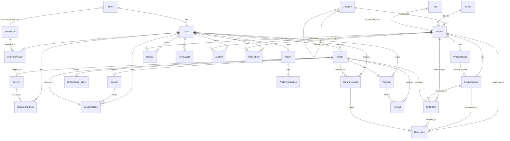

# Entity-Relationship Diagram

```mermaid
erDiagram
    Role ||--o{ User : has
    Role }o--|| Permission : via_role_permissions
    User ||--o{ UserPermission : has
    Permission ||--o{ UserPermission : assigned_to
    User ||--o{ Order : places
    User ||--o{ Payment : makes
    User ||--o{ ShippingAddress : has
    User ||--|| Wallet : owns
    User ||--o{ CouponUsage : uses
    User ||--o{ ReturnRequest : initiates
    User ||--o{ Review : writes
    User ||--o{ ReviewVote : casts
    User ||--o{ CartItem : owns
    User ||--o{ WishlistItem : owns

    Category ||--o{ Category : parent_children
    Category ||--o{ Product : categorizes
    Brand ||--o{ Product : brands
    Tag }o--|| Product : via_product_tags

    Product ||--|{ ProductVariant : has
    Product ||--|{ ProductImage : has
    Product ||--o{ Review : receives
    Product ||--o{ CartItem : referenced_in
    Product ||--o{ WishlistItem : referenced_in
    Product ||--o{ OrderItem : referenced_in
    Product ||--o{ ReturnItem : referenced_in

    ProductVariant ||--o{ OrderItem : referenced_in
    ProductVariant ||--o{ ReturnItem : referenced_in
    ProductImage ||--o| ProductVariant : optional_variant

    Order ||--|{ OrderItem : contains
    Order ||--|{ OrderStatusHistory : tracks
    Order ||--o| Payment : has
    Order ||--o| Delivery : shipped_as
    Order ||--o| Coupon : applies
    Order ||--o{ ReturnRequest : returned_as
    Order ||--o{ Refund : refunds

    OrderItem ||--o{ ReturnItem : returned_in
    ReturnRequest ||--|{ ReturnItem : contains

    Payment ||--o{ Refund : refunds

    Wallet ||--|{ WalletTransaction : logs

    Coupon ||--|{ CouponUsage : tracks
    CouponUsage ||--o| Order : references

    Delivery ||--o| ShippingAddress : delivers_to
```

## Legend

- `||--||` — One-to-One
- `||--o{` — One-to-Many (zero or more)
- `||--|{` — One-to-Many (one or more)
- `}o--||` — Many-to-One
- `}o--o{` — Many-to-Many
