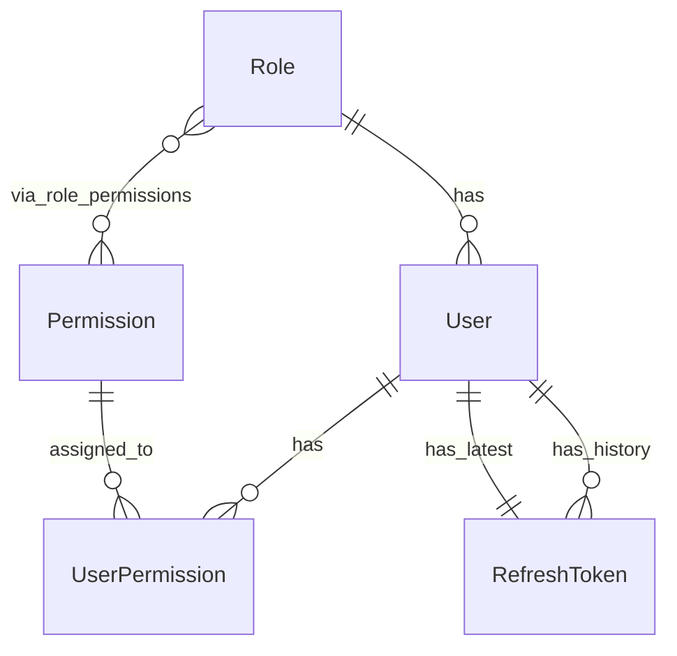
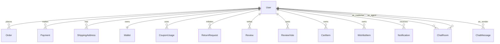
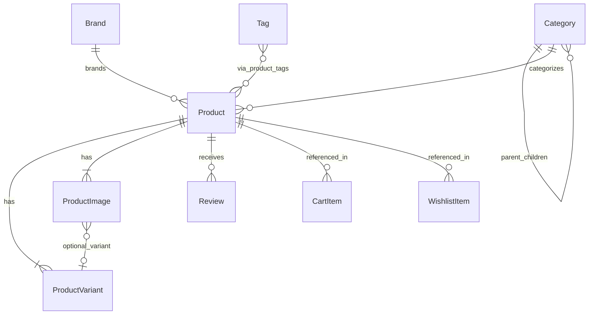
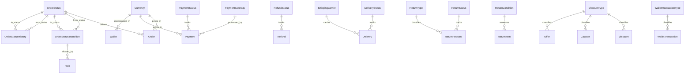
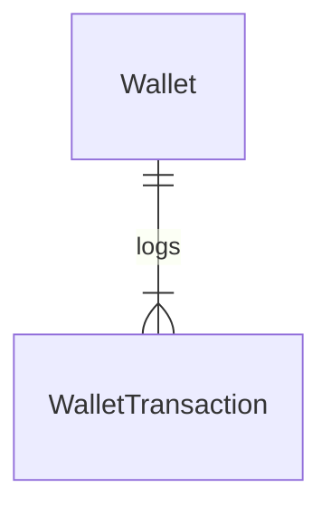
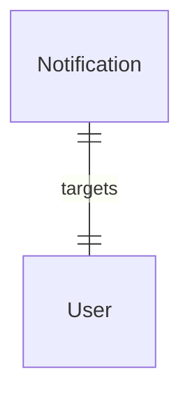
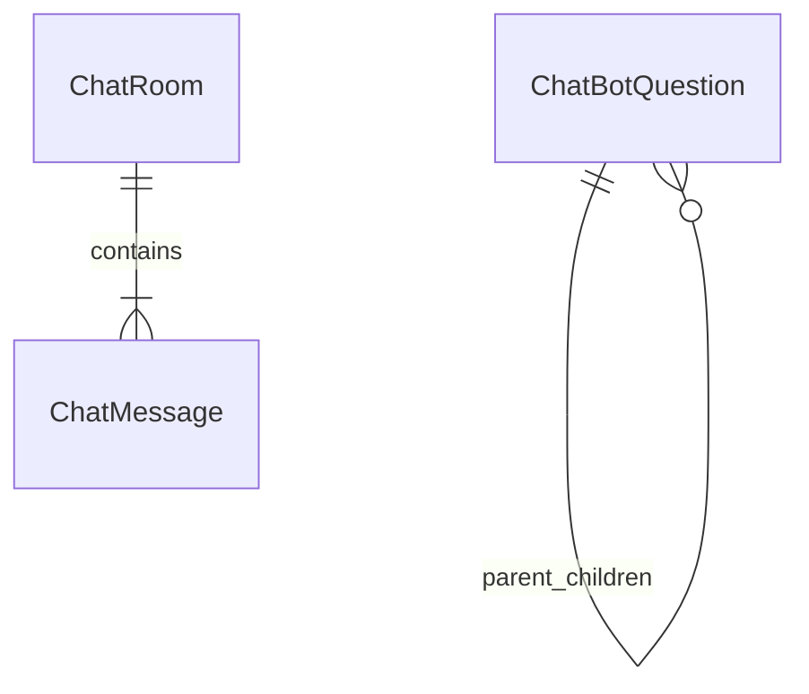

# Entity-Relationship Diagram

## Legend

- `||--||` — One-to-One
- `||--o{` — One-to-Many (zero or more)
- `||--|{` — One-to-Many (one or more)
- `}o--||` — Many-to-One
- `}o--o{` — Many-to-Many
- `..` — Logical FK reference (scalar Long ID, not JPA-managed)

## Users, Roles & Permissions



## User Relationships



## Catalog



## Lookup / Status Tables



## Order, Payment, Delivery (Scalar FK References)

```mermaid
erDiagram
    Order ||--|{ OrderItem : contains
    Order ||--|{ OrderStatusHistory : tracks
    Order ..o| Payment : payed_by
    Order ..o| Delivery : shipped_as
    Order ..o| Refund : refunded_as
    Order ..o{ ReturnRequest : returned_as
    OrderItem ..o{ ReturnItem : returned_in
    ReturnRequest ||--|{ ReturnItem : contains
    ReturnRequest ..o| Refund : refunded_by
    Payment ||--o{ Refund : refunds
```

## Wallet



## Coupons, Discounts, Offers

```mermaid
erDiagram
    Coupon ||--|{ CouponUsage : tracks
    Coupon ||--|{ CouponAssignment : assigned_to
    CouponUsage ..o| Order : applied_to

    Discount ||--|{ DiscountAssignment : assigned_to

    Offer ||--|{ OfferUsage : tracks
    Offer ||--|{ OfferAssignment : assigned_to
```

## Notifications



## Chat / Support



## Full Combined Diagram

```mermaid
erDiagram
    Role ||--o{ User : has
    Role }o--o{ Permission : via_role_permissions
    Permission ||--o{ UserPermission : assigned_to
    User ||--o{ UserPermission : has
    User ||--o{ Order : places
    User ||--o{ Payment : makes
    User ||--o{ ShippingAddress : has
    User ||--|| Wallet : owns
    User ||--o{ CouponUsage : uses
    User ||--o{ ReturnRequest : initiates
    User ||--o{ Review : writes
    User ||--o{ ReviewVote : casts
    User ||--o{ CartItem : owns
    User ||--o{ WishlistItem : owns
    User ||--o{ RefreshToken : has
    User ||--o{ Notification : receives
    User ||--o{ ChatRoom : as_customer
    User ||--o{ ChatRoom : as_agent
    User ||--o{ ChatMessage : as_sender

    Category ||--o{ Category : parent_children
    Category ||--o{ Product : categorizes
    Brand ||--o{ Product : brands
    Tag }o--o{ Product : via_product_tags

    Product ||--|{ ProductVariant : has
    Product ||--|{ ProductImage : has
    Product ||--o{ Review : receives
    Product ||--o{ CartItem : referenced_in
    Product ||--o{ WishlistItem : referenced_in
    ProductImage }o--o| ProductVariant : optional_variant

    OrderStatus ||--o{ Order : defines
    OrderStatus ||--o{ OrderStatusTransition : from_status
    OrderStatus ||--o{ OrderStatusTransition : to_status
    OrderStatus ||--o{ OrderStatusHistory : from_status
    OrderStatus ||--o{ OrderStatusHistory : to_status
    OrderStatusTransition ||--o{ Role : allowed_by

    Currency ||--o{ Order : prices_in
    Currency ||--o{ Payment : prices_in
    Currency ||--o{ Wallet : denominated_in

    PaymentGateway ||--o{ Payment : processed_by
    PaymentStatus ||--o{ Payment : tracks
    RefundStatus ||--o{ Refund : tracks

    DeliveryStatus ||--o{ Delivery : tracks
    ShippingCarrier ||--o{ Delivery : carries

    ReturnStatus ||--o{ ReturnRequest : tracks
    ReturnType ||--o{ ReturnRequest : classifies
    ReturnCondition ||--o{ ReturnItem : assesses

    DiscountType ||--o{ Discount : classifies
    DiscountType ||--o{ Coupon : classifies
    DiscountType ||--o{ Offer : classifies

    WalletTransactionType ||--o{ WalletTransaction : classifies

    Order ||--|{ OrderItem : contains
    Order ||--|{ OrderStatusHistory : tracks
    Order ..o| Payment : payed_by
    Order ..o| Delivery : shipped_as
    Order ..o| Refund : refunded_as
    Order ..o{ ReturnRequest : returned_as
    OrderItem ..o{ ReturnItem : returned_in
    ReturnRequest ||--|{ ReturnItem : contains
    ReturnRequest ..o| Refund : refunded_by
    Payment ||--o{ Refund : refunds
    Wallet ||--|{ WalletTransaction : logs
    Coupon ||--|{ CouponUsage : tracks
    Coupon ||--|{ CouponAssignment : assigned_to
    CouponUsage ..o| Order : applied_to
    Discount ||--|{ DiscountAssignment : assigned_to
    Offer ||--|{ OfferUsage : tracks
    Offer ||--|{ OfferAssignment : assigned_to
    Notification ||--|| User : targets
    ChatRoom ||--|{ ChatMessage : contains
    ChatBotQuestion ||--o{ ChatBotQuestion : parent_children
```

> **Note:** Dotted lines (`..`) represent logical FK references via scalar `Long` fields, not JPA entity relationships. These use raw IDs (`order_id`, `product_id`, `variant_id`, etc.) stored as `@Column` instead of `@ManyToOne`.
