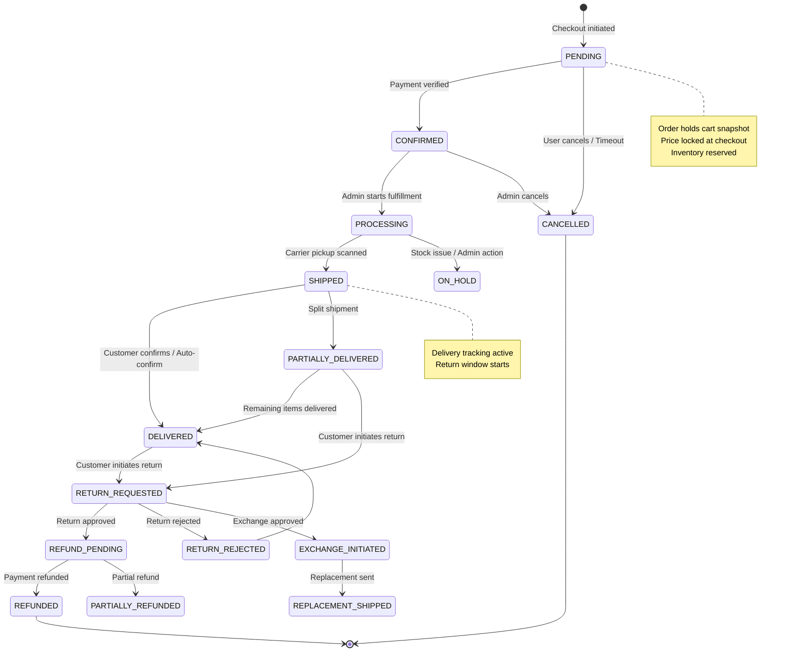
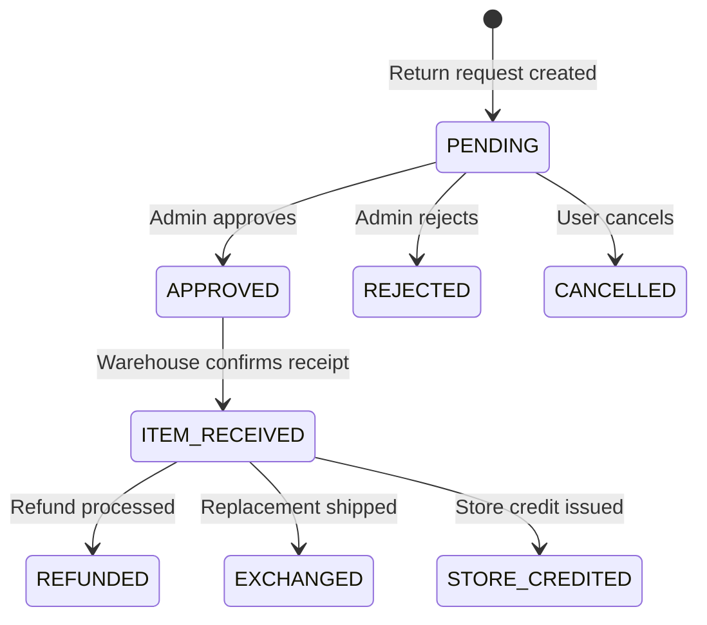

# Order Status Machine

## Order Status Transitions

| From | To | Trigger | By |
|------|----|---------|----|
| PENDING | CONFIRMED | Payment success | System |
| PENDING | CANCELLED | Cancel request / timeout | User / System |
| CONFIRMED | PROCESSING | Admin starts fulfillment | Admin |
| CONFIRMED | CANCELLED | Admin cancels | Admin |
| PROCESSING | SHIPPED | Carrier pickup | Admin / System |
| PROCESSING | ON_HOLD | Stock issue | Admin |
| SHIPPED | DELIVERED | Delivery confirmation | System / User |
| SHIPPED | PARTIALLY_DELIVERED | Split delivery | System |
| DELIVERED | RETURN_REQUESTED | Customer initiates return | User |
| PARTIALLY_DELIVERED | DELIVERED | Remaining delivered | System |
| RETURN_REQUESTED | REFUND_PENDING | Admin approves refund | Admin |
| RETURN_REQUESTED | RETURN_REJECTED | Admin rejects return | Admin |
| RETURN_REQUESTED | EXCHANGE_INITIATED | Admin approves exchange | Admin |
| REFUND_PENDING | REFUNDED | Refund processed | System |
| REFUND_PENDING | PARTIALLY_REFUNDED | Partial refund | System |
| EXCHANGE_INITIATED | REPLACEMENT_SHIPPED | Replacement dispatched | Admin |

## Return Status Machine

