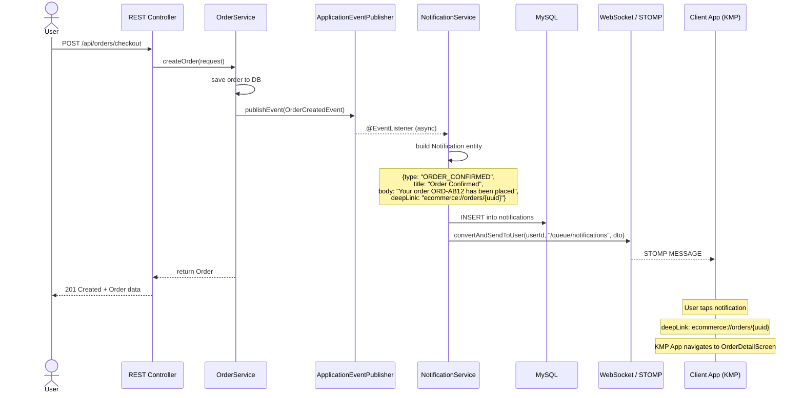
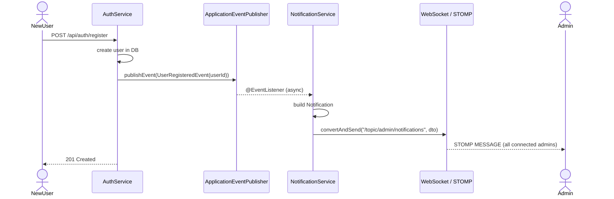
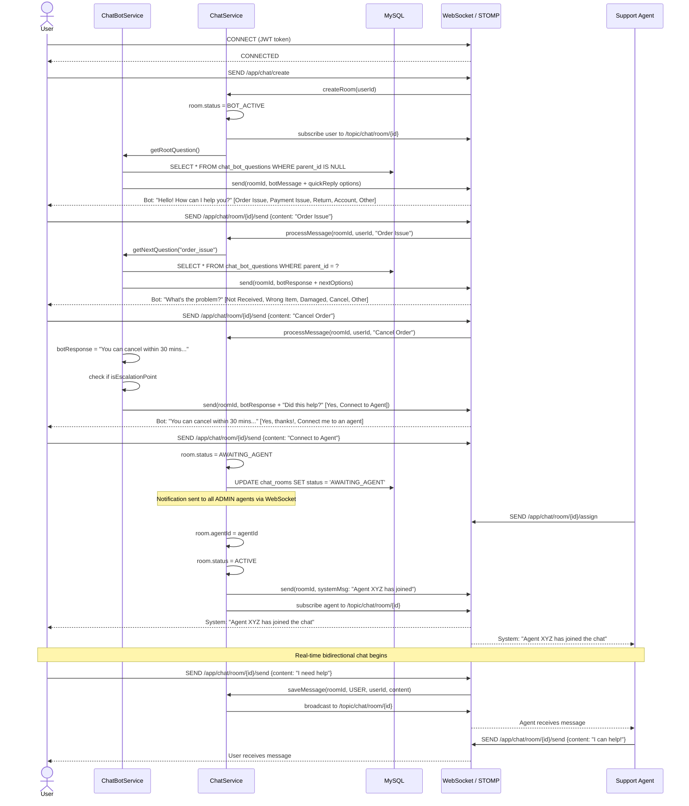
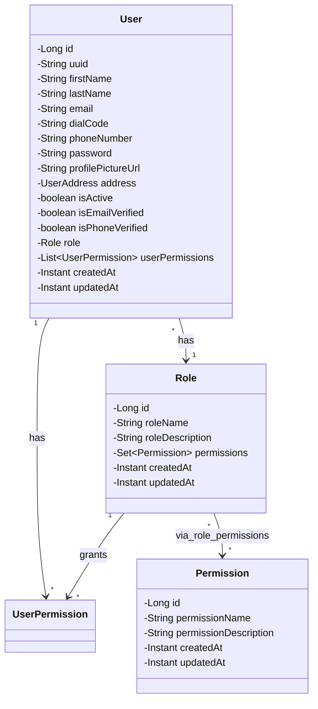
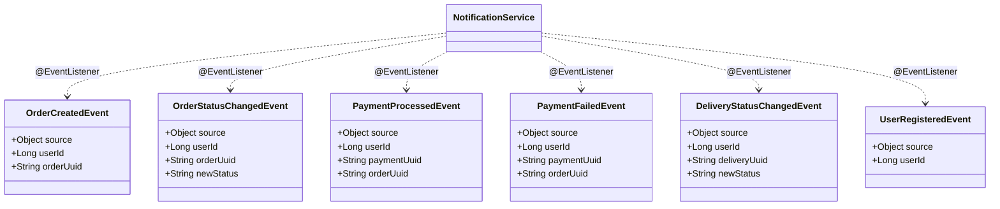

# UML Diagrams

## 1. Architecture Component Diagram

```mermaid
graph TB
    subgraph "Client Layer"
        WEB["Web App (KMP)"]
        MOBILE["Android / iOS App (KMP)"]
    end

    subgraph "API Gateway / REST"
        REST["REST Controllers<br/>/api/**"]
        WS["WebSocket STOMP<br/>/ws"]
    end

    subgraph "Authentication"
        JWT["JWT Filter<br/>OncePerRequestFilter"]
        AUTH["AuthService<br/>Login / Register / Refresh"]
        OTP["OTP Service"]
    end

    subgraph "Business Modules"
        PRODUCT["Product Module<br/>Product, Category, Brand, Tag<br/>Variant, Image, Review"]
        ORDER["Order Module<br/>Order, OrderItem<br/>OrderStatus, History"]
        PAYMENT["Payment Module<br/>Payment, Refund<br/>Wallet, Gateway"]
        USER["User Module<br/>User, Role, Permission"]
        CART["Cart / Wishlist"]
        SHIPPING["Shipping Module<br/>Delivery, Address, Carrier"]
        RETURNS["Returns Module<br/>ReturnRequest, ReturnItem"]
    end

    subgraph "Notification"
        EVENT["Event Bus<br/>Spring Events"]
        NOTIF["NotificationService<br/>Persist + Push"]
        NOTIF_WS["WebSocket Push<br/>/user/queue/notifications"]
    end

    subgraph "Chat / Support"
        CHAT_BOT["ChatBotService<br/>Q&A Triage"]
        CHAT_SVC["ChatService<br/>Room Management"]
        CHAT_WS["WebSocket<br/>/topic/chat/room/{id}"]
    end

    subgraph "Data Layer"
        MYSQL[(MySQL<br/>All Tables)]
        REDIS[(Redis<br/>Future)]
    end

    subgraph "Authorization"
        AOP["AuthorizationAspect<br/>@RequiresPermission"]
    end

    WEB --> REST
    MOBILE --> REST
    WEB --> WS
    MOBILE --> WS
    REST --> JWT
    REST --> AUTH
    REST --> PRODUCT
    REST --> ORDER
    REST --> PAYMENT
    REST --> USER
    REST --> CART
    REST --> SHIPPING
    REST --> RETURNS
    PRODUCT --> MYSQL
    ORDER --> MYSQL
    PAYMENT --> MYSQL
    USER --> MYSQL
    CART --> MYSQL
    SHIPPING --> MYSQL
    RETURNS --> MYSQL
    AUTH --> USER
    AOP --> USER

    ORDER -->|publishEvent| EVENT
    PAYMENT -->|publishEvent| EVENT
    SHIPPING -->|publishEvent| EVENT
    AUTH -->|publishEvent| EVENT
    EVENT -->|@EventListener| NOTIF
    NOTIF --> NOTIF_WS

    CHAT_SVC --> CHAT_WS
    CHAT_BOT --> CHAT_SVC
    CHAT_SVC --> MYSQL
    WS --> CHAT_SVC
    WS --> CHAT_BOT
```

## 2. Notification System — Sequence Diagram



## 3. Admin Notification — Sequence Diagram



## 4. Chat Bot Triage — Sequence Diagram



## 5. Class Diagram — Core Domain



## 6. Class Diagram — Notification Module

```mermaid
classDiagram
    class Notification {
        -Long id
        -String uuid
        -User user
        -String type
        -String title
        -String body
        -String deepLink
        -boolean isRead
        -Instant createdAt
        -Instant readAt
    }

    class NotificationService {
        +sendNotification(userId, type, title, body, deepLink)
        +getUserNotifications(userId, pageable)
        +markAsRead(notificationId)
        +markAllAsRead(userId)
        +getUnreadCount(userId)
        -buildAndPush(userId, type, title, body, deepLink)
    }

    class NotificationController {
        +GET /api/notifications
        +GET /api/notifications/unread-count
        +PATCH /api/notifications/{id}/read
        +PATCH /api/notifications/read-all
    }

    class WebSocketConfig {
        +configureMessageBroker()
        +registerStompEndpoints()
        +configureClientInboundChannel()
    }

    class JwtChannelInterceptor {
        +preSend(message, channel)
        -extractToken(message)
        -authenticate(token)
    }

    NotificationController --> NotificationService
    NotificationService --> Notification
    NotificationService --> WebSocketConfig : uses simpMessagingTemplate
    Notification "1" --> "1" User : targets
```

## 7. Class Diagram — Chat Module

```mermaid
classDiagram
    class ChatRoom {
        -Long id
        -String uuid
        -User user
        -User agent
        -String status
        -String topic
        -Instant createdAt
        -Instant assignedAt
        -Instant closedAt
    }

    class ChatMessage {
        -Long id
        -String uuid
        -ChatRoom room
        -String senderType
        -User sender
        -String content
        -String messageType
        -String metadata
        -Instant createdAt
        -Instant readAt
    }

    class ChatBotQuestion {
        -Long id
        -ChatBotQuestion parent
        -String questionKey
        -String questionText
        -String options
        -String botResponse
        -boolean isEscalationPoint
        -int sortOrder
        -boolean isActive
    }

    class ChatService {
        +createRoom(userId)
        +assignAgent(roomId, agentId)
        +closeRoom(roomId)
        +sendMessage(roomId, senderType, senderId, content, messageType, metadata)
        +getRoomMessages(roomId, pageable)
        +getUserRooms(userId)
        +getOpenRooms()
    }

    class ChatBotService {
        +getRootQuestion()
        +getNextQuestion(currentKey, selectedOption)
        +processUserSelection(questionKey, optionValue)
        +isEscalationRequired(questionKey)
    }

    class ChatController {
        +POST /api/chat/rooms
        +GET /api/chat/rooms
        +GET /api/chat/rooms/{uuid}/messages
        +PATCH /api/chat/rooms/{uuid}/assign
        +PATCH /api/chat/rooms/{uuid}/close
    }

    class ChatWebSocketController {
        +@MessageMapping /chat/create
        +@MessageMapping /chat/room/{roomUuid}/send
        +@MessageMapping /chat/room/{roomUuid}/typing
    }

    ChatRoom "1" --> "*" ChatMessage : contains
    ChatRoom "*" --> "1" User : customer
    ChatRoom "*" --> "0..1" User : agent
    ChatBotQuestion "1" --> "0..*" ChatBotQuestion : parent_children
    ChatController --> ChatService
    ChatWebSocketController --> ChatService
    ChatWebSocketController --> ChatBotService
    ChatService --> ChatRoom
    ChatService --> ChatMessage
    ChatBotService --> ChatBotQuestion
```

## 8. Event Model


